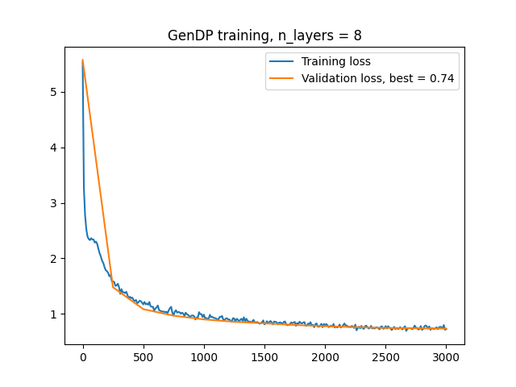

# NanoGPT : NLP Projet

Ce projet a été effectué dans le cadre du cours Natural Language Processing de Georges-André Silber aux Mines de Paris. Ce projet s'inspire en pratique du [nanoGPT](https://github.com/karpathy/nanoGPT) d'Andrej Karpathy. L'objectif de ce projet est de créer un modèle de langue génératif **gendp** à partir des données du droit pénal. Parmi ces codes, le droit pénal peut être vu comme le code pénal, le code de procédure pénale, le code de la sécurité intérieure, le code pénitentiaire, le code de l'entrée et du séjour des étrangers et du droit d'asile et du code de la route.

NanoGPT est un repo permettant un entraînement et un finetuning plus rapide de GPT de taille moyenne (c'est-à-dire une reproduction de GPT-2).

## Installations préalables

```
pip install matplotlib torch numpy transformers datasets tiktoken wandb tqdm pickle strip_markdown requests
```

cf. [nanoGPT](https://github.com/karpathy/nanoGPT) pour les dépendances. [strip_markdown](https://pypi.org/project/strip-markdown/) permet de transcrire les textes en markdown en textes, ce qui servira de préparation de données.

## Préparation des données

Dans le dossier /gendp/markdowns, on retrouve les données initiales. On peut les transformer en texte vers le dossier /gendp/texts, et les concaténer en un seul script **input.txt** en faisant : 

```
$ python .\data\gendp\prepare.py
```

Ce script créé aussi un `train.bin` et un `val.bin` dans ce répertoire, ce qui sera utilisé par le script d'entraînement. En commentaire du script se trouve aussi un ordre de grandeur des différents paramètres : 

- Taille du dataset en caractères : ~136M
- Les caractères uniques : !"#%&'()*+,-./0123456789:;<=>?@ABCDEFGHIJKLMNOPQRSTUVWXYZ[]^_abcdefghijklmnopqrstuvwxyz{|} ¤§¨«­°²³µ¸¹º»¼ÀÂÇÈÉÊËÎÔ×ÛàáâäçèéêëíîïóôöùûüýÿăİŒœšţʹ˂ˮ̀̈ΔΣάέήίαβγδεηθικλμνοπςστυχωόώавгдежикмнортуцчᵉ‒–—―‘’“‟•… ‰€∑−∫≤≥■□fffl **->** nécessité d'un encodage `UTF-8` lors de la lecture et écriture des textes.
- Taille de vocabulaire : ~216
- Tokens d'entraînements : ~122M
- Tokens de validation : ~13M

Ainsi, c'est un bon nombre de paramètres du même ordre de grandeur que GPT2.

**Note :** il se peut que l'encodage de script-markdown ne comprenne pas les caractères non-ASCII, tels que `é`. Dans ce cas, nous avons modifié script_markdown.py pour comprendre ces caractères, l.45 :

```
        with filename.open('w', encoding='utf-8') as f:
```

## Configuration d'entraînement

Afin d'alléger le script d'entraînement, `train.py` passe par `configurator.py` pour chercher si un fichier config, `config\train_gendp.py`, existe. Ce script contient les différents paramètres nécessaires à l'entraînement, comme le learning rate ou la taille du modèle. 

Une fois les paramètres choisis, il suffit de run ceci pour lancer l'entraînement : 

```
$ python .\train.py config/train_gendp.py
```

Le script affichera la loss selon un intervalle spécifique. On observe bien qu'on utilise un GPT, qui est un transformeur de 6 couches et 6 têtes par défaut. 
Avec un GPU Geforce RTX 4060 (qui est très performant!), l'entraînement avec 300 itérations prend quelque minutes, avec une loss de validation minimale d'environ 0.7. Selon la configuration, il est possible d'enregistrer un checkpoint du modèle qui sera réutilisable dans l'entraînement, dans le répertoire `out-gendp`.

Une fois l'entraînement satisfaisant, nous pouvons générer du texte sample.

## Génération de texte

Le sampling s'effectue comme ceci : 

```
$ python .\sample.py --out_dir=out-gendp
```

Le script est aussi paramétrable : le nombre de samples, le nombre de tokens (donc le nombre de caractères maximal)...

Ceci génère des samples, comme par exemple : 

```
Art. L121-1
La commercialisation des établissements publics de coopération intercommunale en application de l'article L. 113-3 est publiée au Journal officiel de l'Union européenne et à l'accomplissement de la police nationale d'affaires par le greffe du tribunal.
Art. L121-5
Le président du conseil territorial est applicable en Nouvelle-Calédonie, sous réserve des adaptations prévues par l'article L. 124-9, des articles L. 123-14 et suivants :
1° Le conseil régional de santé et des propriétaire
---------------

Art. R211-18
Les agents de santé publicitaires fait l'objet d'une autre convention préalable si elles sont rendues en fonction de l'état civil en application de l'article L. 2212-9 du code du travail et d'une société professionnelle agricole agricole à concurrence d'une société d'aménagement collectif de la société conclue en application de l'article L. 2211-18.
Art. L2241-29-1
Les travailleurs de sociétés agréées par l'association des sociétés d'exploitation et d'enseignement supérieur non majo
---------------

Art. R122-3
La présente section est présentée pour les mesures prévues aux articles R. 223-12 à R. 232-87 et portant sur les demandes d'identification du nom des membres présents un président de la cour d'appel ou de la cour d'appel de garantie de procédure pénale de décision.
L'agent comptable peut également alors faire l'objet d'une mission de liberté.
Section 3 : Dispositions relatives à l'autorité administrative civile pour le compte de la commission administrative de l'agence régionale de s
---------------

Ils peuvent être assurés par un organisme intercommunal financier.
Les demandes de prélèvement du soutien mentionnées au premier alinéa du présent article sont précisées par décret, dans le cadre d'un tiers, des conditions communes, définitives et dont la procédure est communiquée.
Les conditions d'accès aux fins de mission publique et de notification des cotisations pénales sont éligibles à l'un des sociétés de gestion de leur demande. Si les intéressés n'ont pas été retirés les fois par an, la
---------------
```

Ceci est plutôt acceptable, car il n'y a pas d'erreurs grammaticales et de vocabulaire flagrantes. La sémantique est possiblement améliorable, mais cela nécessiterait plus que du finetuning. Actuellement, cette génération se fait avec un prompt par défaut `\n`, mais il est possible de passer an argument un fichier `prompt.txt` que le modèle peut compléter (même si le contenu généré n'est pas forcément en lien avec le prompt), par exemple : 

```
$ python .\sample.py --out_dir=out-gendp --start=FILE:prompt.txt
```

Pour le reste du projet, nous allons essayer d'optimiser certains paramètres, comme la taille du modèle ou la taille du contexte.  

